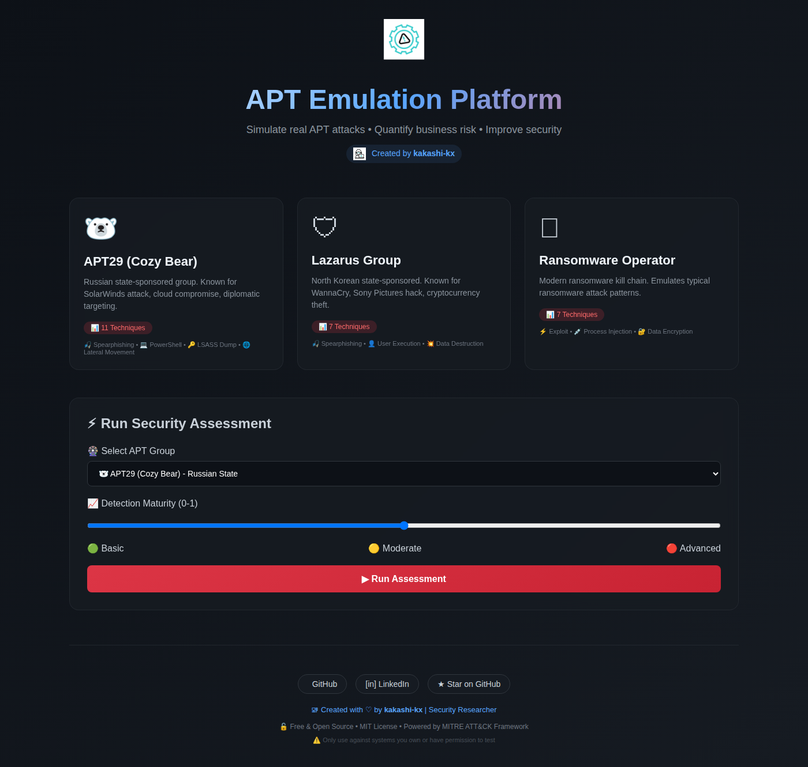
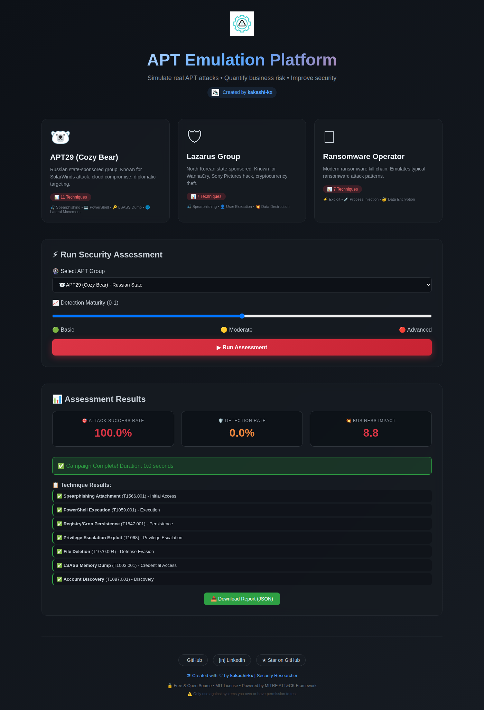
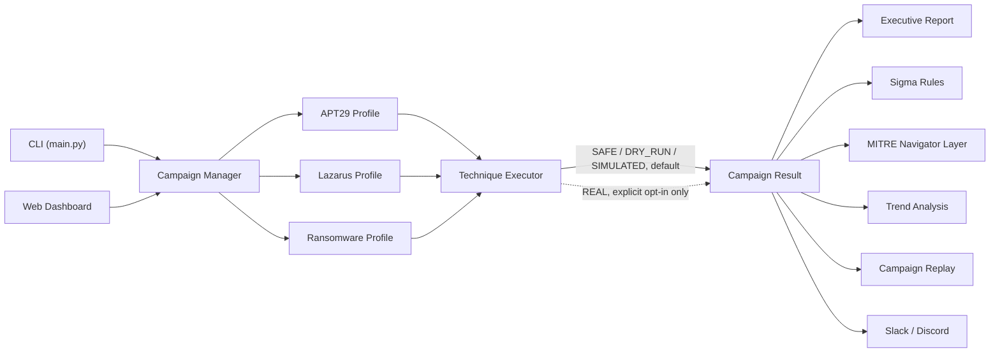

<div align="center">

# 🛡️ APT Emulation Platform

### Enterprise-grade adversary emulation you can run against your own environment — safely, by default.

Emulate real APT29 (Cozy Bear), Lazarus Group, and ransomware operator tradecraft, mapped to MITRE ATT&CK, and find out what your detection stack actually catches — before a real attacker does.

[](https://github.com/kakashi-kx/apt-emulation-platform/actions/workflows/ci.yml)
[](LICENSE)
[](https://www.python.org/)
[](#-quickstart)


[](CONTRIBUTING.md)

[**Quickstart**](#-quickstart) · [**Features**](#-features) · [**Dashboard**](#-dashboard) · [**How it works**](#-how-it-works) · [**Comparison**](#-how-this-compares) · [**Roadmap**](#-roadmap)

</div>

<br>

<div align="center">
  
</div>

<br>

## 🎯 Why this exists

Most security teams don't actually know how many of their detection rules fire under real attacker tradecraft — they know how many rules they *have*. This platform closes that gap: it runs realistic, safe-by-default technique sequences modeled on real threat actors, tells you exactly which ones your stack missed, and hands you the artifacts to fix it — Sigma rules, a MITRE Navigator layer, and an exec-ready report — instead of just a pass/fail score.

It's built for the same use case as Caldera or Atomic Red Team: purple-team exercises, detection engineering validation, and demonstrating security ROI to leadership. **Only run this against systems you own or are explicitly authorized to test.**

## ✨ Features

**Adversary emulation**
- 🇷🇺 **APT29 (Cozy Bear)** — 11 techniques spanning spearphishing through data exfiltration, modeled on the SolarWinds-era playbook
- 🇰🇵 **Lazarus Group** — financially-motivated and destructive tradecraft
- 🔒 **Ransomware Operator** — the full encrypt-and-extort chain
- 🧭 **25 techniques across 12 MITRE ATT&CK tactics**, every one tagged with its technique ID

**Safe by design**
- SAFE mode is the default — techniques are described, never executed, until you explicitly opt in
- Isolated execution modes (`SAFE` / `DRY_RUN` / `SIMULATED` / `REAL`) instead of one code path doing everything
- Rate-limited, hardened web API (secure cookies, CORS allowlist, random secret key, no debug mode in production)

**Reporting & detection engineering**
- 📊 **Executive + CISO-ready reports** — success rate, detection rate, and business impact scoring
- 🧩 **MITRE ATT&CK Navigator export** — drop straight into [Navigator](https://mitre-attack.github.io/attack-navigator/) to visualize coverage gaps
- 📐 **Sigma rule generation** — every undetected technique becomes a draft Sigma rule, portable to Splunk, Elastic, Sentinel, or any SIEM that speaks Sigma
- 📈 **Trend analysis** — track detection coverage across repeated campaigns over time
- 🎬 **Campaign replay** — step through exactly what ran and what got caught
- 🔔 **Slack / Discord notifications** — post live campaign results to your team channel

**Ops-ready**
- 🐳 One-command Docker deployment with a non-root container user and health checks
- ✅ CI pipeline that actually gates on test results
- 🖥️ CLI for automation, or a full web dashboard for click-through assessments

## 🖥️ Dashboard

Pick a threat actor, tune detection maturity, and run the assessment — the dashboard streams results back with a full technique-by-technique breakdown.

<div align="center">
  
</div>

## 🚀 Quickstart

### Docker (fastest)

```bash
git clone https://github.com/kakashi-kx/apt-emulation-platform.git
cd apt-emulation-platform
docker compose up
```

Then open **http://localhost:5000**.

### CLI

```bash
git clone https://github.com/kakashi-kx/apt-emulation-platform.git
cd apt-emulation-platform
pip install -r requirements.txt

# Always start here — SAFE mode describes techniques, never executes them
python3 main.py --apt-group apt29 --safe-mode
```

<details>
<summary><strong>Sample output</strong></summary>

```
============================================================
📊 RESULTS SUMMARY
============================================================

🎯 APT29 (Cozy Bear)
   Success Rate: 100.0%
   Detection Rate: 0.0%
   Impact Score: 8.8/10
   Total Techniques: 11
   ✅ Successful: 11
   ❌ Failed: 0
   🛡️ Detected: 0

============================================================
✅ COMPLETE! Report saved to campaign_results.json
============================================================
```
</details>

### Web (manual, without Docker)

```bash
pip install -r requirements.txt -r requirements-web.txt
python3 web/app.py
```

## 🧠 How it works



Each technique carries its MITRE ATT&CK ID, tactic, detection risk, and success rate. The executor runs it through whichever mode you've selected, and every downstream feature — reports, Sigma rules, the Navigator export — reads off the same result set, so what you see in the dashboard is what ends up in your SIEM.

## ⚖️ How this compares

| | This platform | MITRE Caldera | Atomic Red Team |
|---|---|---|---|
| Setup | `docker compose up` | Server + agent install | Framework install |
| Threat-actor profiles | APT29, Lazarus, Ransomware | Adversary plugins | Individual tests, no narrative |
| Sigma rule generation | ✅ Automatic from gaps | ❌ | ❌ |
| MITRE Navigator export | ✅ Built in | Via plugin | Manual |
| Executive/CISO reporting | ✅ Built in | ❌ | ❌ |
| Web dashboard | ✅ | ✅ | ❌ (CLI only) |
| Safe-by-default execution | ✅ | Depends on plugin | ✅ |

Not a replacement for Caldera's agent-based lateral emulation or Atomic Red Team's sheer test-library size — this trades breadth for a tighter loop from *technique run* → *detection gap* → *Sigma rule* → *exec report*.

## 🗺️ Roadmap

- [ ] **Adaptive AI adversary** — an LLM-driven engine that picks its next technique based on what got detected so far, instead of a fixed sequence
- [ ] Expand technique coverage per profile (25 → 100+)
- [ ] Cloud (AWS/Azure/GCP) and container/Kubernetes technique sets
- [ ] Expose `SIMULATED` mode (probabilistic success/detection) through the CLI and web UI
- [ ] Plugin system for community-contributed threat-actor profiles

## 🤝 Contributing

Issues and PRs are welcome — see [CONTRIBUTING.md](CONTRIBUTING.md). New technique definitions, additional threat-actor profiles, and SIEM export formats are especially appreciated.

## 🔒 Security

Found a vulnerability? Please see [SECURITY.md](SECURITY.md) for responsible disclosure instead of opening a public issue.

## 📄 License

MIT — see [LICENSE](LICENSE).

---

## ⚠️ Disclaimer

This tool is for **security testing and educational purposes only**. Only use against systems you own or have explicit permission to test. The author is not responsible for any misuse or damage caused by this tool.

## 📞 Contact

- **GitHub**: [@kakashi-kx](https://github.com/kakashi-kx)
- **LinkedIn**: [abhixjith](https://www.linkedin.com/in/abhixjith)
- **Project Issues**: [GitHub Issues](https://github.com/kakashi-kx/apt-emulation-platform/issues)

---

<div align="center">

If this is useful to you, a ⭐ helps other people find it.

</div>

<div align="center">

  *Created with ❤️ by kakashi-kx/kakashi4kx | Security Researcher*

</div>

---

